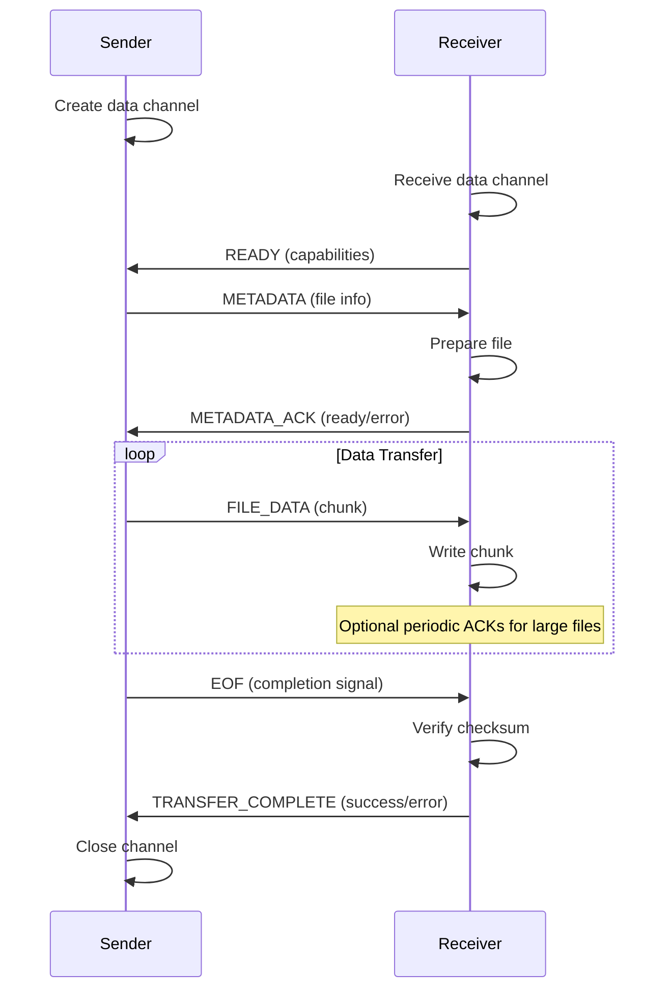
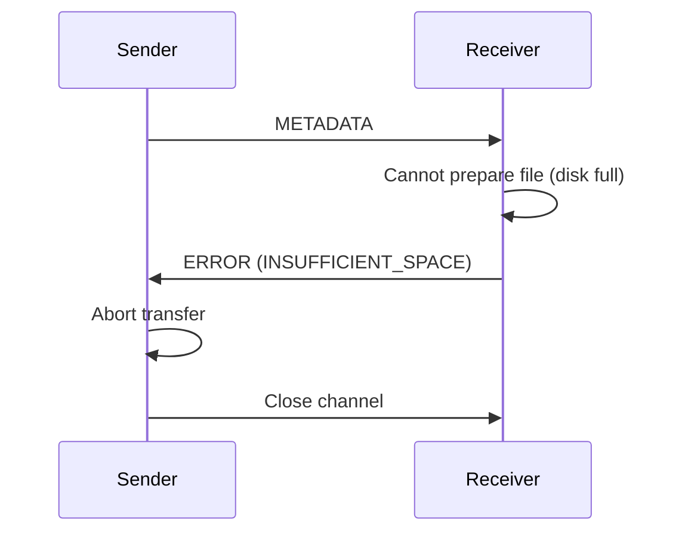

# Bidirectional Message Protocol Specification

## Protocol Overview

This specification defines a bidirectional message protocol for YAPFS file transfers that adds acknowledgement and error handling capabilities while maintaining backward compatibility.

## Message Format

### Base Message Structure
```json
{
    "type": "MESSAGE_TYPE",
    "payload": "base64_encoded_data",
    "error": "error_description", 
    "id": "unique_message_id",
    "timestamp": "2025-06-23T10:30:00Z"
}
```

### Wire Format
Messages are sent over WebRTC data channels with a JSON header followed by optional binary payload:
```
[4-byte length][JSON header][optional binary payload]
```

## Message Types

### Control Messages

#### READY
**Direction**: Receiver → Sender  
**Purpose**: Indicates receiver is ready to accept file transfer  
**Payload**: Receiver capabilities
```json
{
    "type": "READY",
    "payload": {
        "protocol_version": "1.1",
        "supports_acknowledgements": true,
        "max_chunk_size": 65536,
        "supported_compression": ["none", "gzip"]
    }
}
```

#### METADATA_ACK  
**Direction**: Receiver → Sender  
**Purpose**: Acknowledges successful metadata processing  
**Payload**: File preparation status
```json
{
    "type": "METADATA_ACK", 
    "payload": {
        "status": "ready",
        "prepared_path": "/path/to/destination/file.txt",
        "free_space": 1073741824
    }
}
```

#### TRANSFER_COMPLETE
**Direction**: Receiver → Sender  
**Purpose**: Confirms successful file transfer and verification  
**Payload**: Transfer completion details
```json
{
    "type": "TRANSFER_COMPLETE",
    "payload": {
        "bytes_received": 1048576,
        "checksum_verified": true,
        "final_path": "/path/to/destination/file.txt"
    }
}
```

#### ERROR
**Direction**: Both  
**Purpose**: Reports errors during transfer  
**Payload**: Error details
```json
{
    "type": "ERROR",
    "error": "disk_full",
    "payload": {
        "code": "INSUFFICIENT_SPACE",
        "details": "Need 1GB, only 500MB available",
        "recoverable": false
    }
}
```

### Data Messages

#### METADATA
**Direction**: Sender → Receiver  
**Purpose**: File metadata and transfer information  
**Payload**: File metadata (same as current implementation)
```json
{
    "type": "METADATA",
    "payload": {
        "name": "document.pdf",
        "size": 1048576,
        "mimeType": "application/pdf", 
        "checksum": "sha256:abc123...",
        "protocol_version": "1.1"
    }
}
```

#### FILE_DATA
**Direction**: Sender → Receiver  
**Purpose**: File content chunks  
**Payload**: Binary file data
- JSON header contains chunk metadata
- Binary payload contains actual file data

#### EOF
**Direction**: Sender → Receiver  
**Purpose**: Indicates end of file data  
**Payload**: Final transfer summary
```json
{
    "type": "EOF",
    "payload": {
        "total_bytes": 1048576,
        "chunks_sent": 256,
        "expected_checksum": "sha256:abc123..."
    }
}
```

## Protocol Flow

### Enhanced Bidirectional Flow



### Error Handling Flow



## State Machines

### Sender State Machine
```
INITIALIZING → WAITING_FOR_READY → SENDING_METADATA → WAITING_FOR_METADATA_ACK → 
TRANSFERRING_DATA → WAITING_FOR_COMPLETION → COMPLETED
           ↓                    ↓                    ↓                      ↓
           ERROR ←─────────────────────────────────────────────────────────┘
```

### Receiver State Machine
```
INITIALIZING → READY → RECEIVING_METADATA → PREPARING_FILE → RECEIVING_DATA → 
VERIFYING_CHECKSUM → COMPLETED
           ↓         ↓                   ↓               ↓                 ↓
           ERROR ←───────────────────────────────────────────────────────┘
```

## Timeout and Retry Specifications

### Timeout Values
- **READY message**: 10 seconds
- **METADATA_ACK**: 15 seconds  
- **TRANSFER_COMPLETE**: 30 seconds
- **Data chunk acknowledgement**: 5 seconds (for large files)

### Retry Logic
- **Connection timeouts**: 3 retries with exponential backoff
- **Message acknowledgements**: 2 retries before error
- **Data chunks**: No automatic retry (report error and abort)

## Backward Compatibility

### Legacy Protocol Support (v1.0)
- Messages without JSON structure treated as legacy format
- "METADATA:" prefix detection for legacy metadata
- "EOF" string detection for legacy completion
- No acknowledgements sent in legacy mode

### Protocol Negotiation
1. Receiver sends READY with protocol version
2. If sender supports version, uses enhanced protocol  
3. If version mismatch, fallback to legacy protocol
4. Version field in all messages for compatibility

## Error Codes

### Standard Error Codes
- `INSUFFICIENT_SPACE`: Not enough disk space
- `PERMISSION_DENIED`: Cannot write to destination
- `CHECKSUM_MISMATCH`: File verification failed
- `TIMEOUT`: Operation timed out
- `PROTOCOL_ERROR`: Invalid message or sequence
- `CANCELLED`: Transfer cancelled by user
- `NETWORK_ERROR`: WebRTC connection issues

## Security Considerations

### Message Validation
- Maximum message size: 1MB for control messages
- Maximum payload size: 64KB for data chunks  
- Message type validation against enum
- JSON structure validation
- Timeout enforcement to prevent hanging

### Error Information
- Error messages should not leak sensitive paths
- Sanitize error details before transmission
- Rate limiting for error messages

## Implementation Notes

### Message Serialization
- Use `encoding/json` for message headers
- Base64 encoding for binary payloads in JSON
- Direct binary transmission for file data chunks

### Performance Considerations
- Minimize JSON parsing overhead during data transfer
- Use structured logging for protocol events
- Buffer management for flow control
- Concurrent acknowledgement processing

### Testing Strategy
- Unit tests for each message type serialization/deserialization
- State machine transition testing
- Timeout and retry scenario testing
- Protocol negotiation compatibility testing
- Error condition simulation and recovery testing

This specification provides the foundation for implementing robust bidirectional communication while maintaining the simplicity and performance of the current YAPFS file transfer system.